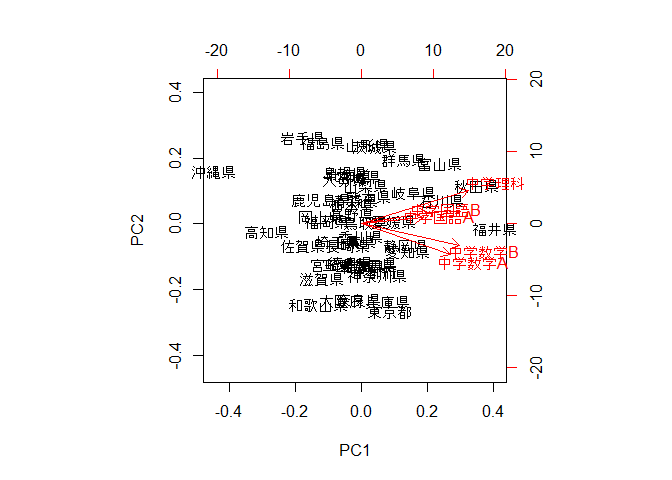
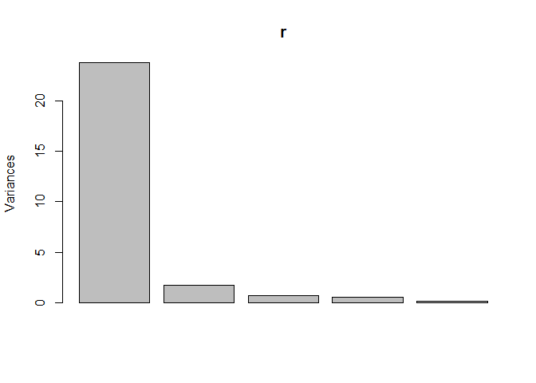
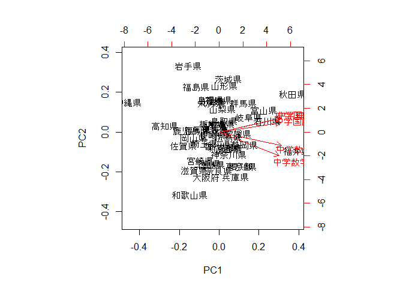
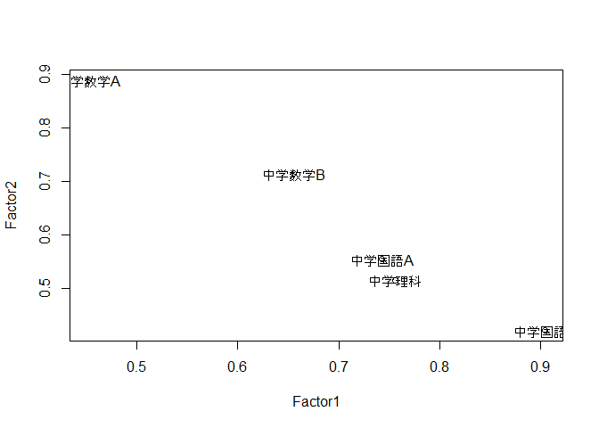

chapter11 主成分分析と因子分析
================

-   [11.1 多変量データ](#多変量データ)
-   [11.2 主成分分析](#主成分分析)
-   [11.3 例：中野・西島・ゲルマンの法則](#例中野西島ゲルマンの法則)
-   [11.4 因子分析](#因子分析)

``` r
library(tidyverse)
```

11.1 多変量データ
-----------------

``` r
atest <- 
  read_csv("https://raw.githubusercontent.com/okumuralab/RforFun/master/data/atest2015.csv") 

names(atest)
```

    ##  [1] "都道府県"  "小学国語A" "小学国語B" "小学算数A" "小学算数B"
    ##  [6] "小学理科"  "中学国語A" "中学国語B" "中学数学A" "中学数学B"
    ## [11] "中学理科"

``` r
chu <- 
  atest %>% 
  column_to_rownames("都道府県") %>%  # 都道府県名を行名にする
  select(6:10) # 中学のテスト結果のみを選択する
```

    ## Warning: Setting row names on a tibble is deprecated.

``` r
plot(chu)
```


``` r
cor(chu)
```

    ##           中学国語A 中学国語B 中学数学A 中学数学B  中学理科
    ## 中学国語A 1.0000000 0.9062628 0.8307854 0.8446749 0.8674915
    ## 中学国語B 0.9062628 1.0000000 0.7831577 0.8951718 0.9013279
    ## 中学数学A 0.8307854 0.7831577 1.0000000 0.9325483 0.8012841
    ## 中学数学B 0.8446749 0.8951718 0.9325483 1.0000000 0.8394486
    ## 中学理科  0.8674915 0.9013279 0.8012841 0.8394486 1.0000000

11.2 主成分分析
---------------

``` r
r <- prcomp(chu)
```

``` r
par(xpd=TRUE)
biplot(r)
```



``` r
summary(r)
```

    ## Importance of components:
    ##                           PC1    PC2    PC3     PC4     PC5
    ## Standard deviation     4.8796 1.3107 0.8097 0.69549 0.30421
    ## Proportion of Variance 0.8898 0.0642 0.0245 0.01808 0.00346
    ## Cumulative Proportion  0.8898 0.9540 0.9785 0.99654 1.00000

``` r
plot(r)
```



``` r
biplot(prcomp(chu, scale = TRUE)) # 点数を標準化する
```



11.3 例：中野・西島・ゲルマンの法則
-----------------------------------

(省略)

11.4 因子分析
-------------

``` r
f <- factanal(chu, factors = 2)
f
```

    ## 
    ## Call:
    ## factanal(x = chu, factors = 2)
    ## 
    ## Uniquenesses:
    ## 中学国語A 中学国語B 中学数学A 中学数学B  中学理科 
    ##     0.141     0.005     0.005     0.059     0.162 
    ## 
    ## Loadings:
    ##           Factor1 Factor2
    ## 中学国語A 0.743   0.555  
    ## 中学国語B 0.904   0.421  
    ## 中学数学A 0.452   0.889  
    ## 中学数学B 0.655   0.715  
    ## 中学理科  0.756   0.516  
    ## 
    ##                Factor1 Factor2
    ## SS loadings      2.574   2.053
    ## Proportion Var   0.515   0.411
    ## Cumulative Var   0.515   0.926
    ## 
    ## Test of the hypothesis that 2 factors are sufficient.
    ## The chi square statistic is 12.28 on 1 degree of freedom.
    ## The p-value is 0.000459

``` r
plot(f$loadings)
text(f$loadings, names(chu))
```


