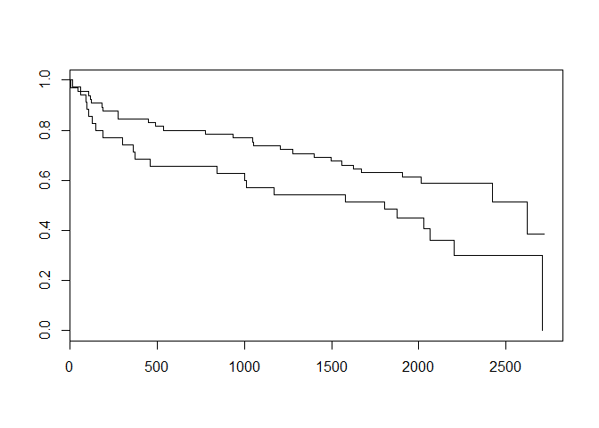

Chapter13 生存時間解析
================

-   [13.1 プロローグ](#プロローグ)
-   [13.2 生存時間解析](#生存時間解析)

``` r
library(tidyverse)
```

13.1 プロローグ
---------------

``` r
fisher.test(matrix(c(19,28,40,31), nrow = 2))
```

    ## 
    ##  Fisher's Exact Test for Count Data
    ## 
    ## data:  matrix(c(19, 28, 40, 31), nrow = 2)
    ## p-value = 0.1321
    ## alternative hypothesis: true odds ratio is not equal to 1
    ## 95 percent confidence interval:
    ##  0.2321089 1.1843236
    ## sample estimates:
    ## odds ratio 
    ##  0.5288016

13.2 生存時間解析
-----------------

``` r
library(survival)

whas100 <- 
  read_csv("https://raw.githubusercontent.com/okumuralab/RforFun/master/data/whas100.csv")
```

``` r
s <- 
  survfit(Surv(lenfol, fstat) ~ gender, whas100)

summary(s)
```

    ## Call: survfit(formula = Surv(lenfol, fstat) ~ gender, data = whas100)
    ## 
    ##                 gender=0 
    ##  time n.risk n.event survival std.err lower 95% CI upper 95% CI
    ##     6     65       2    0.969  0.0214        0.928        1.000
    ##    44     63       1    0.954  0.0260        0.904        1.000
    ##   107     62       1    0.938  0.0298        0.882        0.999
    ##   114     61       1    0.923  0.0331        0.861        0.990
    ##   123     60       1    0.908  0.0359        0.840        0.981
    ##   182     59       1    0.892  0.0384        0.820        0.971
    ##   189     58       1    0.877  0.0407        0.801        0.961
    ##   274     57       2    0.846  0.0448        0.763        0.939
    ##   451     55       1    0.831  0.0465        0.744        0.927
    ##   492     54       1    0.815  0.0481        0.726        0.915
    ##   538     53       1    0.800  0.0496        0.708        0.903
    ##   774     52       1    0.785  0.0510        0.691        0.891
    ##   936     51       1    0.769  0.0523        0.673        0.879
    ##  1048     50       1    0.754  0.0534        0.656        0.866
    ##  1054     49       1    0.738  0.0545        0.639        0.853
    ##  1205     48       1    0.723  0.0555        0.622        0.840
    ##  1278     47       1    0.708  0.0564        0.605        0.827
    ##  1401     46       1    0.692  0.0572        0.589        0.814
    ##  1497     45       1    0.677  0.0580        0.572        0.801
    ##  1557     44       1    0.662  0.0587        0.556        0.787
    ##  1624     43       1    0.646  0.0593        0.540        0.774
    ##  1669     42       1    0.631  0.0599        0.524        0.760
    ##  1907     35       1    0.613  0.0608        0.504        0.744
    ##  2012     24       1    0.587  0.0634        0.475        0.726
    ##  2421      8       1    0.514  0.0883        0.367        0.720
    ##  2624      4       1    0.385  0.1295        0.199        0.744
    ## 
    ##                 gender=1 
    ##  time n.risk n.event survival std.err lower 95% CI upper 95% CI
    ##    14     35       1    0.971  0.0282        0.918        1.000
    ##    62     34       1    0.943  0.0392        0.869        1.000
    ##    89     33       1    0.914  0.0473        0.826        1.000
    ##    98     32       1    0.886  0.0538        0.786        0.998
    ##   104     31       1    0.857  0.0591        0.749        0.981
    ##   128     30       1    0.829  0.0637        0.713        0.963
    ##   148     29       1    0.800  0.0676        0.678        0.944
    ##   187     28       1    0.771  0.0710        0.644        0.924
    ##   302     27       1    0.743  0.0739        0.611        0.903
    ##   363     26       1    0.714  0.0764        0.579        0.881
    ##   374     25       1    0.686  0.0785        0.548        0.858
    ##   461     24       1    0.657  0.0802        0.517        0.835
    ##   841     23       1    0.629  0.0817        0.487        0.811
    ##  1002     22       1    0.600  0.0828        0.458        0.786
    ##  1011     21       1    0.571  0.0836        0.429        0.761
    ##  1172     20       1    0.543  0.0842        0.401        0.736
    ##  1577     19       1    0.514  0.0845        0.373        0.710
    ##  1806     18       1    0.486  0.0845        0.345        0.683
    ##  1874     14       1    0.451  0.0853        0.311        0.653
    ##  2031     10       1    0.406  0.0879        0.266        0.620
    ##  2065      9       1    0.361  0.0889        0.223        0.585
    ##  2201      6       1    0.301  0.0922        0.165        0.549
    ##  2710      1       1    0.000     NaN           NA           NA

``` r
plot(s)
```



``` r
survdiff(Surv(lenfol, fstat) ~ gender, whas100)
```

    ## Call:
    ## survdiff(formula = Surv(lenfol, fstat) ~ gender, data = whas100)
    ## 
    ##           N Observed Expected (O-E)^2/E (O-E)^2/V
    ## gender=0 65       28     34.6      1.27      3.97
    ## gender=1 35       23     16.4      2.68      3.97
    ## 
    ##  Chisq= 4  on 1 degrees of freedom, p= 0.0463
