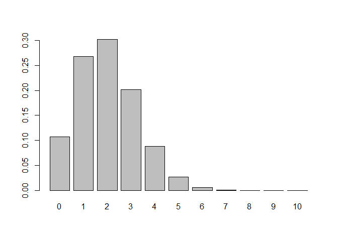
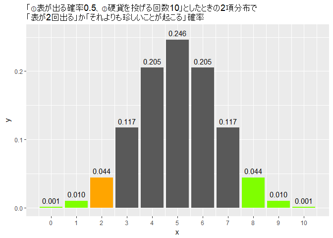

Chapter3 2項分布、検定、信頼区間
================

-   [3.1 2項分布](#項分布)
-   [3.2 統計的仮説検定の考え方](#統計的仮説検定の考え方)
-   [3.3 統計的仮説検定に関する議論](#統計的仮説検定に関する議論)
-   [3.4 多重検定](#多重検定)
-   [3.5 信頼区間](#信頼区間)
-   [3.6 2項分布から正規分布へ](#項分布から正規分布へ)
-   [3.7 検定の例：PISAの「盗難事件」問題](#検定の例pisaの盗難事件問題)
-   [3.8 信頼区間の例](#信頼区間の例)
-   [3.9 尤度と最尤法](#尤度と最尤法)
-   [3.10 止め方で結果が変わる？](#止め方で結果が変わる)

3.1 2項分布
-----------

次のような事象を考えてみる。

1.  「50%の確率で表がでる硬貨」を「10回投げた」とき、「表が出た硬貨が5枚になる確率」は?
2.  「1%の確率で当たる宝くじ」を「1000枚買った」とき、「当たりくじが10枚になる確率」は?
3.  「1年以内の死亡率が0.2%であることが分かっている集団」で「1万人を選んだ」とき、「1年後の死亡者が15人になる確率」は?

もっと一般に(つまり"5枚"や"10枚"や"15人"ではなく)、次のような事象を考えてみる。

1.  「50%の確率で表がでる硬貨」を「10回投げた」とき、「表が出た硬貨がr枚になる確率」は?
2.  「1%の確率で当たる宝くじ」を「1000枚買った」とき、「当たりくじがr枚になる確率」は?
3.  「1年以内の死亡率が0.2%であることが分かっている集団」で「1万人を選んだ」とき、「1年後の死亡者がr人になる確率」は?

「①ある確率でおこる事象(例、50%の確率で表がでる、1%の確率で当たる宝くじ、etc)」を「②ある回数だけ繰り返す(例、10回投げた)」または「②ある分だけ集める(例、1000枚買った)」ときの確率分布を、2項分布、という。
2項分布のインプットに必要な変数は①と②であり、アウトプットは「③事象がr回起こる確率」の確率分布になる。
例えば、上記1～3の2項分布は以下のようなグラフになる。


教科書では、①をθ(シータ、と読む)、②をn、③がr と書いてある。
また、「rが2項分布(**Binom**ial distribution)に従う」ことを「r ~ Binom(n, θ)」と書くことにしている。

さて、教科書に出てくるコインの例で、2項分布を味わってみる。
確率0.4(θ = 0.4)で表が出る硬貨を、10回投げた時(n = 10)、3回(r = 3)表がでる確率は、dbinom関数で求めることができる。

``` r
dbinom(3, 10, 0.4)
```

    ## [1] 0.2149908

θとnは同じで、表が1枚、2枚、3枚でる確率は、以下の通り、求められる。

``` r
x <- 1:3
x
```

    ## [1] 1 2 3

``` r
dbinom(x, 10, 0.4)
```

    ## [1] 0.04031078 0.12093235 0.21499085

三つ目の成分(xの第三成分、つまり3)のときは、上記の計算と確率が一致していることを確認できる。xなど用いずに、もっと直接的に、以下のように求めることもできる。

``` r
dbinom(1:3, 10, 0.4)
```

    ## [1] 0.04031078 0.12093235 0.21499085

さて、θとnは同じで、表が0枚から10枚でる確率を計算するには、どうするか？

``` r
dbinom(0:10, 10, 0.4) # 教科書とはθの値が異なることに注意する
```

    ##  [1] 0.0060466176 0.0403107840 0.1209323520 0.2149908480 0.2508226560
    ##  [6] 0.2006581248 0.1114767360 0.0424673280 0.0106168320 0.0015728640
    ## [11] 0.0001048576

上記をヒストグラムにしてみる。

``` r
barplot(dbinom(0:10, 10, 0.4), names.arg = 0:10) # 教科書とはθの値が異なることに注意する
```


表が出る確率が0.2となるように作られた2項分布はどうなるか？(θを変える)

-   表の出る回数の平均値は、0.4の時よりも、小さくなりそうだ。
-   表の出る枚数が、何枚の時に、確率が最大になりそうか？

``` r
barplot(dbinom(0:10, 10, 0.2), names.arg = 0:10)
```



表が出る確率は0.4のままで、試行回数を100にすると、どうなるか？(nを変える)

-   分布の平均値は、試行回数が10の時と変わりそうか？
-   表の出る枚数が、何枚の時に、確率が最大になりそうか？

``` r
barplot(dbinom(0:100, 100, 0.4), names.arg = 0:100)
```


少し分布が横につぶれているので、ズームしてみよう。(rの範囲を変える)

``` r
barplot(dbinom(15:70, 100, 0.4), names.arg = 15:70)
```


上記の通り、dbinom関数のパラメータであるθ、n、rを変えることで、様々な2項分布が描けることがわかる。自分でも、描いてみよう。

3.2 統計的仮説検定の考え方
--------------------------

いま、硬貨を10回投げたら、2回表が出た。 この硬貨は公正に作られているだろうか?
それともイカサマを疑ったほうがいいのか?
(今回は「イカサマだ!」と言いたい心情になってください)

以下では、統計的仮説検定の枠組みで、「硬貨を10回投げたら、2回表が出た」ということがイカサマであるかどうか、確認してみよう。

-   まずは、証明したい仮説と、否定したい仮説を思い描く
    -   証明したい仮説を「対立仮説」、否定したい仮説を「帰無仮説」と呼ぶことにする
    -   例えば、硬貨がイカサマであることを証明したいときは、
        -   対立仮説：「硬貨がイカサマである」
        -   帰無仮説：「硬貨はイカサマではない(公正である)」
-   否定したい仮説(帰無仮説)「硬貨はイカサマではない(公正である)」をもとにした確率密度関数※を描く
    -   ①イカサマのない公正な硬貨であれば、表と裏がでる確率は等しく0.5となる
    -   ②硬貨は10回投げた
    -   「①表が出る確率0.5、②硬貨を投げる回数10」としたときの確率分布は、2項分布で(binomial distribution)で求められ、Binom(n = 10, θ = 0.5)、となる
    -   以下は、Binom(n = 10, θ = 0.5)としたときの確率密度関数※のグラフである

※2項分布のときは、「確率密度関数」ではなく「確率質量関数」と呼ぶのが正しいが、両者は同じものだと思ってよい。どちらも「面積 = 確率」となるような関数である


もしくは若干シンプルに、以下のようにも描ける。

``` r
barplot(dbinom(0:10, 10, 0.5), names.arg = 0:10)
```


-   この確率密度関数で、「現実に起きたこと」または「それよりも珍しいこと」が起こる確率を求める。これをp値(ピーチ)と呼ぶ
    -   現実に起きたこと：「硬貨を10回投げたら2回表が出た」(オレンジ色の面積)
    -   現実に起きたことより珍しいこと(緑の面積)
    -   オレンジと緑の面積(=確率)の合計値は0.109375であり、これがp値である



-   上記のp値の値を持って、「否定したい仮説(帰無仮説)」を否定できるか判断する
    -   今回のp値は0.109375であった
    -   これを翻訳すると「公正に作られた硬貨であっても、10.9375%くらいの確率で、表が2枚しかでないこと、またはそれよりももっと珍しいこと(表が1枚、0枚など)が起こる」という意味合いになる
    -   10%程度の確率を「まれなこと」と考える場合は、「公正に作られた硬貨にしてはまれなことが起こっている。つまり、この硬貨は公正に作られていない」と結論できる
        -   「帰無仮説は棄却された」と言う
    -   10%程度なら「起こりうる」と考える場合は、「公正に作られた硬貨で、今回たまたま10%程度の事象が起こったのかもしれない」と考える
        -   「帰無仮説は棄却できない」と言う
        -   「帰無仮説が正しかった」という意味ではない
    -   実際には、5%という値を境にして、判断することが多いようである(5%に明確な根拠はない)
        -   この「境」のことを**有意水準**という。上記でいえば、「5%有意水準」と言ったりする
        -   有意水準は自分で決めていい
        -   「5%(20回に1回起こるくらいの確率)って、偶然起きた、とは言えないくらい低い確率だよね」と言えるなら、「5%有意水準」にすればいい
        -   「1%(100回に1回起きるくらいの確率)だとしても、偶然だと思う」なら、「1%」では有意水準に高すぎるので、もっと低くすべきである

さて、上記までの手続きを**統計的仮説検定、統計的検定、仮説検定、検定**、という。
特に、2項分布を使う検定を、**2項検定**という。
勘のいい方は気づいたかもしれないが、これまでに紹介した様々な(2項分布以外の)確率分布でも、検定をすることができる。データをよく表す確率分布を選び(例、コイン投げの場合は2項分布が適切な確率分布である)、その分布で検定を行うことで、現実の問題でも検定を行うことができる。

2項分布については、上記のような計算をしなくても、2項検定を行ってくれるbinom.test関数がある。便利だ。上記と同じ問題(「硬貨を10回投げたら、2回表が出た」)を、binom.test関数で計算してみよう。

``` r
binom.test(2, 10, 0.5)
```

    ## 
    ##  Exact binomial test
    ## 
    ## data:  2 and 10
    ## number of successes = 2, number of trials = 10, p-value = 0.1094
    ## alternative hypothesis: true probability of success is not equal to 0.5
    ## 95 percent confidence interval:
    ##  0.02521073 0.55609546
    ## sample estimates:
    ## probability of success 
    ##                    0.2

最後のインプットであるθの値0.5はデフォルト値なので、省略しても同じ結果になる。

``` r
binom.test(2, 10)
```

    ## 
    ##  Exact binomial test
    ## 
    ## data:  2 and 10
    ## number of successes = 2, number of trials = 10, p-value = 0.1094
    ## alternative hypothesis: true probability of success is not equal to 0.5
    ## 95 percent confidence interval:
    ##  0.02521073 0.55609546
    ## sample estimates:
    ## probability of success 
    ##                    0.2

p-valueという項目が、上記で述べたp値(ピーチ)である。
p値にだけアクセスしたいときは、上記関数の最後に$p.valueを付け加えればよい。

``` r
binom.test(2,10)$p.value
```

    ## [1] 0.109375

ちなみに、str関数を使えば、データがどのような構造(**str**cture)になっているか、のぞくことができる。
binome.test(2,10)の中身をのぞくと以下の通り。

``` r
str(binom.test(2,10))
```

    ## List of 9
    ##  $ statistic  : Named num 2
    ##   ..- attr(*, "names")= chr "number of successes"
    ##  $ parameter  : Named num 10
    ##   ..- attr(*, "names")= chr "number of trials"
    ##  $ p.value    : num 0.109
    ##  $ conf.int   : atomic [1:2] 0.0252 0.5561
    ##   ..- attr(*, "conf.level")= num 0.95
    ##  $ estimate   : Named num 0.2
    ##   ..- attr(*, "names")= chr "probability of success"
    ##  $ null.value : Named num 0.5
    ##   ..- attr(*, "names")= chr "probability of success"
    ##  $ alternative: chr "two.sided"
    ##  $ method     : chr "Exact binomial test"
    ##  $ data.name  : chr "2 and 10"
    ##  - attr(*, "class")= chr "htest"

もちろん、$p.valueも確認できる。他にもをドルマークをつかって、binome.test(2,10)の中身の項目にアクセスしてみよう。

3.3 統計的仮説検定に関する議論
------------------------------

冒頭の部分で、いくつか専門用語が出てくるので、解説しておきます。

が、まずはこの[サイト("仮説検定とは？初心者にもわかりやすく解説！")](https://to-kei.net/hypothesis-testing/about-2/)を読んでみてください。

-   **対立仮説**：3.1で述べました。帰無仮説と反対になるような(対立するような)仮説。だいたいの場合は、この対立仮説を肯定したい(帰無仮説を否定したい)ことが多い。
-   **第1種の誤り**：帰無仮説(否定したいこと)が正しいのにも関わらず、帰無仮説を棄却してしまうこと。
-   **第2種の誤り**： 対立仮説(証明していこと・肯定していこと)が正しいのにも関わらず、帰無仮説を棄却しないこと。

p値は「①標本の大きさ(調べた個数)」と「②モデル(帰無仮説)からのずれの大きさ」に依存する(教科書では①のみ述べられているが、②も大切だと思う)。

①10回ではp値が有意にならなくても、100回なら有意になることがある。

``` r
binom.test(2, 10, 0.5) # 試行回数10
```

    ## 
    ##  Exact binomial test
    ## 
    ## data:  2 and 10
    ## number of successes = 2, number of trials = 10, p-value = 0.1094
    ## alternative hypothesis: true probability of success is not equal to 0.5
    ## 95 percent confidence interval:
    ##  0.02521073 0.55609546
    ## sample estimates:
    ## probability of success 
    ##                    0.2

``` r
binom.test(4, 20, 0.5) # 試行回数20
```

    ## 
    ##  Exact binomial test
    ## 
    ## data:  4 and 20
    ## number of successes = 4, number of trials = 20, p-value = 0.01182
    ## alternative hypothesis: true probability of success is not equal to 0.5
    ## 95 percent confidence interval:
    ##  0.057334 0.436614
    ## sample estimates:
    ## probability of success 
    ##                    0.2

``` r
binom.test(10, 50, 0.5) # 試行回数50
```

    ## 
    ##  Exact binomial test
    ## 
    ## data:  10 and 50
    ## number of successes = 10, number of trials = 50, p-value =
    ## 2.386e-05
    ## alternative hypothesis: true probability of success is not equal to 0.5
    ## 95 percent confidence interval:
    ##  0.1003022 0.3371831
    ## sample estimates:
    ## probability of success 
    ##                    0.2

``` r
binom.test(20, 100, 0.5) # 試行回数100
```

    ## 
    ##  Exact binomial test
    ## 
    ## data:  20 and 100
    ## number of successes = 20, number of trials = 100, p-value =
    ## 1.116e-09
    ## alternative hypothesis: true probability of success is not equal to 0.5
    ## 95 percent confidence interval:
    ##  0.1266556 0.2918427
    ## sample estimates:
    ## probability of success 
    ##                    0.2

もっと言うと、nが大きければ、モデル(帰無仮説)からのわずかな差も検出できるようになる。

``` r
binom.test(35, 100, 0.4)
```

    ## 
    ##  Exact binomial test
    ## 
    ## data:  35 and 100
    ## number of successes = 35, number of trials = 100, p-value = 0.3584
    ## alternative hypothesis: true probability of success is not equal to 0.4
    ## 95 percent confidence interval:
    ##  0.2572938 0.4518494
    ## sample estimates:
    ## probability of success 
    ##                   0.35

``` r
binom.test(350, 1000, 0.4)
```

    ## 
    ##  Exact binomial test
    ## 
    ## data:  350 and 1000
    ## number of successes = 350, number of trials = 1000, p-value =
    ## 0.001239
    ## alternative hypothesis: true probability of success is not equal to 0.4
    ## 95 percent confidence interval:
    ##  0.3204161 0.3804702
    ## sample estimates:
    ## probability of success 
    ##                   0.35

``` r
binom.test(3500, 10000, 0.4)
```

    ## 
    ##  Exact binomial test
    ## 
    ## data:  3500 and 10000
    ## number of successes = 3500, number of trials = 10000, p-value <
    ## 2.2e-16
    ## alternative hypothesis: true probability of success is not equal to 0.4
    ## 95 percent confidence interval:
    ##  0.3406464 0.3594411
    ## sample estimates:
    ## probability of success 
    ##                   0.35

逆に、②モデル(帰無仮説)からのずれが大きければ、nが大きくなくても、p値が低くなる(有意になる)ことがある。

``` r
binom.test(4, 10, 0.5)
```

    ## 
    ##  Exact binomial test
    ## 
    ## data:  4 and 10
    ## number of successes = 4, number of trials = 10, p-value = 0.7539
    ## alternative hypothesis: true probability of success is not equal to 0.5
    ## 95 percent confidence interval:
    ##  0.1215523 0.7376219
    ## sample estimates:
    ## probability of success 
    ##                    0.4

``` r
binom.test(3, 10, 0.5)
```

    ## 
    ##  Exact binomial test
    ## 
    ## data:  3 and 10
    ## number of successes = 3, number of trials = 10, p-value = 0.3438
    ## alternative hypothesis: true probability of success is not equal to 0.5
    ## 95 percent confidence interval:
    ##  0.06673951 0.65245285
    ## sample estimates:
    ## probability of success 
    ##                    0.3

``` r
binom.test(2, 10, 0.5)
```

    ## 
    ##  Exact binomial test
    ## 
    ## data:  2 and 10
    ## number of successes = 2, number of trials = 10, p-value = 0.1094
    ## alternative hypothesis: true probability of success is not equal to 0.5
    ## 95 percent confidence interval:
    ##  0.02521073 0.55609546
    ## sample estimates:
    ## probability of success 
    ##                    0.2

``` r
binom.test(1, 10, 0.5)
```

    ## 
    ##  Exact binomial test
    ## 
    ## data:  1 and 10
    ## number of successes = 1, number of trials = 10, p-value = 0.02148
    ## alternative hypothesis: true probability of success is not equal to 0.5
    ## 95 percent confidence interval:
    ##  0.002528579 0.445016117
    ## sample estimates:
    ## probability of success 
    ##                    0.1

さて、p値が、自分が設定した有意水準より小さくなった時は、**帰無仮説が棄却**され、**対立仮説を採択**する。
では、有意水準に達しなかった場合は、**帰無仮説を採択**するのだろうか。結論を言えば、「帰無仮説は採択されない」。「帰無仮説か対立仮説のどちらが正しいかわからない」というのが、この場合の正しい結論である。
この点は、冒頭で紹介した[サイト("仮説検定とは？初心者にもわかりやすく解説！")](https://to-kei.net/hypothesis-testing/about-2/)が詳しいので参考にされたい。

3.4 多重検定
------------

p値の有意水準は、0.01(1%)であるとか、0.05(5%)であるとか、0.1(10%)であるとか、自由に決めてよい、ということは話した。

いま、5%を有意水準にするとしよう。この意味合いは「20回に1回くらい起こる事象なら珍しいことなので、それより低いp値が出たら、帰無仮説を棄却するつもり」である。

一方で、まったく無意味な乱数データでも、20回に1回くらいは、5%水準で有意になる。「なんだ、そんなことでは、危ないじゃないか」と思う方は、有意水準をもっと厳しくして、1%にすればよい。それでも、100回に1回くらいは、「無意味な乱数データを有意と判定してしまう」ことがある。有意水準とは、このような危険を常にはらんでいるものである。それでも、自分が支持したい仮説(対立仮説、と言った)の確信度を、(色々な仮定を置きながら)p値という確率で計算できることに、便利さを感じてもらいたい。

さて、自分が支持したい仮説には、やはり低いp値がでてほしいものである。心情としてはわかる。なので、古来、以下のような、p値を低く見せる手法(**p-hacking、pハッキング**)が研究(?)されてきた。

-   何回も実験し、うまく行った時のp値だけ報告する
-   p値を低くするために、データの一部を間引く
-   p値が低くなるまで、実験を繰り返して、データを追加する。p値が希望する水準まで低くなったとき、データの追加をやめる
-   一つのデータセットに様々な検定を行い、p値が低い検定結果だけ報告する、etc

これらの一部を指して**多重検定**ということがある。冒頭に述べたように、何回も検定をしていれば、無意味な乱数データでも、20回に1回くらいは、5%水準で有意になる。結果がほしくて、検定を繰り返してはならない。繰り返した場合は、それを補正する方法が、いくつか紹介されているが、複雑である。補正しないで、繰り返してしまった検定のp値を共有して、解釈を任せてもよい。

科学の領域でも、pハッキングが起こっている(っぽい)。[この論文](http://journals.plos.org/plosone/article?id=10.1371/journal.pone.0127872)では、心理学で提出された5,000超の論文で、論文で報告されたp値のヒストグラムをとっている。グラフを見ると、きりのいい数値、特に0.05や0.01となるp値が多い。これだけでpハッキングをしているとは結論づけられないが、興味深い。

ただ、p値が悪いわけではない。人の使い方が悪いのである。 このような事例は、科学技術でも多い(例、ダイナマイト、原子力、etc)。 みなさんは、「初めて火を手にした人間」のように、p値を良く使うこともできるし、悪く使うこともできる。 みなさんの倫理が試されている(かもしれない)。

3.5 信頼区間
------------

2項検定をすると、
95 percent confidence interval:
0.02521073 0.55609546
というようなものが表示される。

``` r
binom.test(2, 10, 0.5)
```

    ## 
    ##  Exact binomial test
    ## 
    ## data:  2 and 10
    ## number of successes = 2, number of trials = 10, p-value = 0.1094
    ## alternative hypothesis: true probability of success is not equal to 0.5
    ## 95 percent confidence interval:
    ##  0.02521073 0.55609546
    ## sample estimates:
    ## probability of success 
    ##                    0.2

これが**信頼区間(confidence interval, CI)**と呼ばれるものである(上記は95%信頼区間)。

信頼区間の解釈は、少し難しい。 上記で言えば、95%信頼区間は\[0.02521073 0.55609546\]である。これは、コインの表が出る確率の信頼区間である。 これは「このコイン(10回中2回表がでた)の表が出る確率は、95%の確率で、0.025～0.556の間に収まる」という**意味ではない**。

「実験につかったコインの表が出る真の確率」は、なにか一定している値があり、「0.025～0.556」を変動したりはしないからである(伝統的な統計学・頻度主義の解釈)。「実験につかったコインの表が出る真の確率」は、母平均に似ていて、何回測っても変化はしないはずである(実際には「真の確率」は測定できないが)。

では、どのように解釈するかと言うと、「サンプルから得られたコインの表がでる確率(標本平均に似ていて、サンプルを取るたびに変わる)は、何回もサンプルを取ってそのたびに確率を計算すると(例えば100回サンプルを取って100個の確率を計算すると)、95%(例えば100回サンプルとったときの95回分で)は、この信頼区間の中に収まる」と解釈する。分かりにくい。その通り。 まぁ、だいたい「このコイン(10回中2回表がでた)の表が出る真の確率は、0.025～0.556の間に収まるだろう」くらいのことは言っていいと思う。

今回は、2項検定を例にとったが、その他の確率分布(例、正規分布、ポアソン分布、etc)を使う検定でも、信頼区間を計算できる。信頼区間の解釈は、2項分布ではなく、正規分布の検定で考えたほうが、分かりやすいかもしれない。以下に、いくつかリンクを貼っておく。

1.  [標準誤差とは何なのか。95％信頼区間から分かる推定精度のおはなし【視聴率を調べる手法】](https://atarimae.biz/archives/9881#95)
2.  [信頼区間(wikipedia)](https://ja.wikipedia.org/wiki/%E4%BF%A1%E9%A0%BC%E5%8C%BA%E9%96%93)

さて、信頼区間で重要なのは、サンプルサイズを増やすと、信頼区間が狭くなることである。 2項検定で、サンプルサイズを増やしつつ、信頼区間を取り出して見てみよう。$conf.intで、信頼区間だけを取り出すことができる。

``` r
binom.test(2, 10, 0.5)$conf.int # サンプルサイズ10
```

    ## [1] 0.02521073 0.55609546
    ## attr(,"conf.level")
    ## [1] 0.95

``` r
binom.test(4, 20, 0.5)$conf.int # サンプルサイズ20
```

    ## [1] 0.057334 0.436614
    ## attr(,"conf.level")
    ## [1] 0.95

``` r
binom.test(10, 50, 0.5)$conf.int # サンプルサイズ50
```

    ## [1] 0.1003022 0.3371831
    ## attr(,"conf.level")
    ## [1] 0.95

``` r
binom.test(20, 100, 0.5)$conf.int # サンプルサイズ100
```

    ## [1] 0.1266556 0.2918427
    ## attr(,"conf.level")
    ## [1] 0.95

``` r
binom.test(200, 1000, 0.5)$conf.int # サンプルサイズ1000
```

    ## [1] 0.1756206 0.2261594
    ## attr(,"conf.level")
    ## [1] 0.95

だんだんと、95%信頼区間の幅が狭くなっていくことが分かる。 信頼区間の幅を求めてみよう。diff関数で差分(**diff**erence)を求めることができる。サンプルサイズは10、1000、100000、で試してみよう。

``` r
diff(binom.test(2, 10, 0.5)$conf.int) # サンプルサイズ10
```

    ## [1] 0.5308847

``` r
diff(binom.test(200, 1000, 0.5)$conf.int) # サンプルサイズ1000
```

    ## [1] 0.0505388

``` r
diff(binom.test(20000, 100000, 0.5)$conf.int) # サンプルサイズ100000
```

    ## [1] 0.004968318

勘の良い方はお気づきかもしれないが、サンプルサイズをnとすると、だいたい1/√nに比例して小さくなっている。どこかで見たことがあるような…そう、標準誤差も、サンプルサイズnに対して、1/√nで反比例していた(2章2.4を参照のこと)。

さきほど紹介した[サイト](https://atarimae.biz/archives/9881#95)には、正規分布を例にとって、"母平均の95%信頼区間は、「標本平均 ± 2×標準誤差」"と書かれている。つまり、サンプルサイズが小さくなる→標準誤差が小さくなる→信頼区間が小さくなるのである。

上記サイトでは、"正規分布に従う場合"と限定しているが、nが十分大きいときは、2項分布の信頼区間を計算するときに正規分布で近似できて、正規分布の標準誤差と同じように1/√nで反比例する、と言える。

さて、これまで"95%"信頼区間を前提としていたが、"99%"信頼区間もあるのだろうか。実はある。binom.test関数には、信頼区間のパーセントを指定するconf.levelというオプションがあり、デフォルト値は0.95である。なので、何も指定しなければ、95%信頼区間が求まるが、この数値を変えることで任意の信頼区間にすることができる。

それでは、同じ確率θ、同じ試行回数nの場合は、95%信頼区間と99%信頼区間は、どちらのほうが広い区間になるだろうか。下記のコードで95%信頼区間と99%信頼区間を比べてみる。結果を見て、そうなる理由を考えてみよう。

``` r
binom.test(2, 10, 0.5, conf.level = 0.95)$conf.int
```

    ## [1] 0.02521073 0.55609546
    ## attr(,"conf.level")
    ## [1] 0.95

``` r
binom.test(2, 10, 0.5, conf.level = 0.99)$conf.int
```

    ## [1] 0.01085051 0.64820117
    ## attr(,"conf.level")
    ## [1] 0.99

3.6 2項分布から正規分布へ
-------------------------

確率θおこる事象をn回試行する(またはn個あつめる)ときの確率分布が、2項分布binom(n, θ)であった。この時、n=1の場合は、2項分布と言わず、**ベルヌーイ分布**と呼ぶ。[ベルヌーイ、は人の名前に由来する](https://ja.wikipedia.org/wiki/%E3%83%99%E3%83%AB%E3%83%8C%E3%83%BC%E3%82%A4%E5%88%86%E5%B8%83)。

さて、nをどんどん増やしたらどうなるか。2項分布(ベルヌーイ分布)でも中心極限定理が成り立ち、nが十分大きくなれば、正規分布に近づく。

3.7 検定の例：PISAの「盗難事件」問題
------------------------------------

1998年に508件、1999年に516件の盗難事件が起きた。
「1999年は、1998年に比べて、盗難事件が増えている」と主張できるだろうか。

-   帰無仮説：盗難事件が1998年に起こる確率も、1999年に起こる確率も等しい。
-   対立仮説：盗難事件が1998年に起こる確率は、1999年に起こる確率よりも、低い。

帰無仮説が正しいなら、2年で1024件(= 508 + 516)の盗難事件が起こったが、両年で盗難事件がおこる確率が等しいとすると、どちらの年にも1024件のうち50%ずつがわり振られるはずである。実際は、1998年は508件しか割り振られていないが、これはn = 1024、θ = 0.5の2項検定で有意になるほど小さい値だろうか。

``` r
binom.test(508, 508+516, 0.5)
```

    ## 
    ##  Exact binomial test
    ## 
    ## data:  508 and 508 + 516
    ## number of successes = 508, number of trials = 1024, p-value =
    ## 0.8269
    ## alternative hypothesis: true probability of success is not equal to 0.5
    ## 95 percent confidence interval:
    ##  0.4650308 0.5271792
    ## sample estimates:
    ## probability of success 
    ##              0.4960938

p値は0.8以上であり、統計的な有意差があるとは、とても言えない。

ここからは補足なので、飛ばしてもよい。
今回の例では、ポアソン分布に従う検定(ポアソン検定)を使ってもよい。というか、そちらのほうがわかりやすい。

ポアソン分布(第4章で説明する)は、一定期間に平均してx回起こるような、比較的まれな事象をモデル化する確率分布である(例、一定期間におこる、交通事故数、苦情数、死者数、病欠数、etc)。

今回は、帰無仮説「1年間に516件起きた盗難事件と、同じ期間で508件起きた盗難事件に、差があるか」を調べる。poisson.test関数の引数は、それぞれ、検定にかけたい事象の数(516件)、その事象が起こった期間(1年)、比較したい基準になる発生率(508件/1年)。

``` r
poisson.test(516, 1, 508)
```

    ## 
    ##  Exact Poisson test
    ## 
    ## data:  516 time base: 1
    ## number of events = 516, time base = 1, p-value = 0.7226
    ## alternative hypothesis: true event rate is not equal to 508
    ## 95 percent confidence interval:
    ##  472.4328 562.5044
    ## sample estimates:
    ## event rate 
    ##        516

3.8 信頼区間の例
----------------

1000人のうち200人が現内閣を支持すると答えた(支持率20%)。このアンケート結果から、支持率が低いと言えるだろうか。

帰無仮説は「支持率に差がない」にしよう(支持率が高い、ではない)。支持率に差がないなら、支持率は50%になりそうである(50%なら支持とも不支持とも言えない)。つまり、n = 1000、θ = 0.5の二項検定で判定すればよい。

``` r
binom.test(200, 1000, 0.5) # 教科書では0.5(デフォルト値)を省略している
```

    ## 
    ##  Exact binomial test
    ## 
    ## data:  200 and 1000
    ## number of successes = 200, number of trials = 1000, p-value <
    ## 2.2e-16
    ## alternative hypothesis: true probability of success is not equal to 0.5
    ## 95 percent confidence interval:
    ##  0.1756206 0.2261594
    ## sample estimates:
    ## probability of success 
    ##                    0.2

p値は十分小さく、世の中の多くの人も(nを増やしても)、不支持と結論できる確率が高い。このとき、支持率は、95%信頼区間のもとで17.6～22.6%くらいの間に収まりそうである。

さて、この結果を見た上司から「95%信頼区間で支持率20%台と言いたい。つまり信頼区間の下限を20%以上にしたいのだよ」と指示が来た。あなたは、サンプルサイズを何人まで増やさなければならないだろうか。試しに、1万人にアンケートをとり、かつ、「2000人が不支持と答えるだろう」という仮定を持って(現時点では回答割合がどうなるか分からないので)、2項検定を行ってみよう。

``` r
binom.test(2000, 10000, 0.5)
```

    ## 
    ##  Exact binomial test
    ## 
    ## data:  2000 and 10000
    ## number of successes = 2000, number of trials = 10000, p-value <
    ## 2.2e-16
    ## alternative hypothesis: true probability of success is not equal to 0.5
    ## 95 percent confidence interval:
    ##  0.1921984 0.2079767
    ## sample estimates:
    ## probability of success 
    ##                    0.2

1万人にアンケートをとっても、95%信頼区間の下限は20%を超えない。 上司には「1000人から1万人に増やすために10倍のコストをかけたとしても、信頼区間の下限は20%を超えなそうです。10倍以上のコストをかけても、やるべきですか？」と質問できるだろう。こうやって、無茶な上司を撃退できるのだ。

3.9 尤度と最尤法
----------------

(省略)

3.10 止め方で結果が変わる？
---------------------------

(省略)
