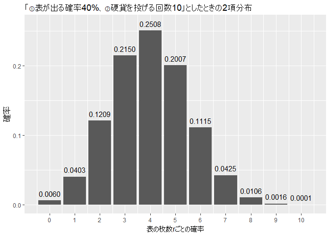

Chapter4 事件の起こる確率
================

-   [4.1 富の分布](#富の分布)
-   [4.2 地震の確率](#地震の確率)
-   [4.3 「ランダムに事象が起きる」という考え方](#ランダムに事象が起きるという考え方)

4.1 富の分布
------------

2項分布のヒストグラムを描くには、確率p(教科書第2章ではθ)と試行回数nが必要だった。
前章では、"「①ある確率でおこる事象(例、50%の確率で表がでる、1%の確率で当たる宝くじ、etc)」を「②ある回数だけ繰り返す(例、10回投げた)」または「②ある分だけ集める(例、1000枚買った)」ときの確率分布を、2項分布、という。2項分布のインプットに必要な変数は①と②であり、アウトプットは「③事象がr回起こる確率」の確率分布になる。 "と説明した。 ①がpで、②がnである。

さて、あるp(例えば、0.4)と、あるn(例えば、10)に従う2項分布を考えてみよう(例、表が出る確率が0.4のコインを10回投げる時の2項分布)。表が出る平均回数を問われれば、多くの人は「4回(= 0.4 × 10)」と答えるだろう。もっと一般に(これは数学っぽい言い回しだが、0.4や10に限らずどんなpやどんなnでも、くらいの意味)、p × nが2項分布の平均になりそうなことは想像しやすい。

さて、平均p × nを一定に保ったまま、確率pの値を限りなく小さくしてみよう。pを小さくするのに、平均p × nを一定に保つには、nを大きくしていかなければならないことがわかる。詳しい数式は省略するが、平均p × n(= λ、ラムダ、と読む)を一定に保ったまま、pを小さくすると、2項分布の式が簡略化でき、λのみに従う確率分布を定義することができる。これをポアソン分布(Poisson distribution)と呼ぶ。このポアソン分布は、平均がλ(これは前記の通り、2項分布のp × nと等しいので、当たり前な感じがする)、分散がλ(これはちょっと不思議な気がするが、2項分布の分散n × p × (1-p)を見ると、納得がいくかもしれない)となる、面白い分布である。

前項の、pはとても小さく、nはとても大きい、そんな確率分布で表現できるのは、どんな事象だろうか？少し想像してみてほしい。

-   一定期間に、事故で亡くなる人の数：亡くなる可能性のある人数nは多いが、事故死の確率pは低い
-   一定期間に、苦情が起こる数：問い合わせの数は多いが、苦情率pは低い
-   一定期間に、ある交差点でタクシーを見る確率：自動車の数nは多いが、それがタクシーである確率pは低い
-   一定期間に、あるATMを使用しようと訪れる人の数：ATMの前を通りすぎる人nは多いが、そのATMを利用する確率pは低い

このような現象をモデル化できるのが、ポアソン分布である。十分低い確率pと、そこそこの試行回数nがあれば、pとnに従う2項分布は、λ(= n × p)に従うポアソン分布で近似できる。

4.2 地震の確率
--------------

(読んでもいいですが、省略します)

4.3 「ランダムに事象が起きる」という考え方
------------------------------------------

1200秒間(一定期間、と言えるだろう)に、38回ランダムに起こる事象と、17回ランダムに起こる事象があるとき、両者のグラフは以下のようになる。

``` r
plot(c(0, 1200), c(0,3), type="n", axes = FALSE, xlab = "", ylab = "")
axis(1)
r1 = runif(17) * 1200 # 0～1秒間に17回起こる一様分布に従う乱数を1200倍したもの。 runif(17, min = 0, max = 1200)と意味は一緒
r2 = runif(38) * 1200 # 0～1秒間に38回起こる一様分布に従う乱数を1200倍したもの。 runif(38, min = 0, max = 1200)と意味は一緒
segments(r1, 0.5, r1, 1.5)
segments(r2, 2, r2, 3)
```



「一定期間に一定回数が起こる」と言われると、私たちは無意識に、均等な間隔で発生することを予期してしまうが、まったくランダムに発生するときは、上のグラフのように続けざまに事象が起こることもあるし、しばらく事象が起こらないこともある。例えば、ある交差点を、タクシーがまったくランダムに横切るとき、続けざまに2～3台通過することもあれば、5分待っても1台も通らないこともあるだろう。そんなとき、これからは「なんでタクシーを拾いたいときに限って、タクシーが来ないんだ！」と憤るのではなく、「タクシーの通過台数は、本当にポアソン分布に従うんだなぁ」と穏やかな気持ちになってほしい。

さて、1200秒という一定期間のうちに、17回起こることは、38回起こることよりも、少ないと言えるだろうか。両者がまったくランダムに起こった事象ならば、「合計55回(= 17 + 38)をランダムに2つにそれぞれ50%ずつ分配するときに、片方が17回になってしまう」という対立仮説を、2項検定にかければいい。

``` r
binom.test(17, 17+38, 0.5)
```

    ## 
    ##  Exact binomial test
    ## 
    ## data:  17 and 17 + 38
    ## number of successes = 17, number of trials = 55, p-value =
    ## 0.006456
    ## alternative hypothesis: true probability of success is not equal to 0.5
    ## 95 percent confidence interval:
    ##  0.1914464 0.4481297
    ## sample estimates:
    ## probability of success 
    ##              0.3090909

これは、2項検定(2項分布を使った検定)ではなく、ポアソン検定(ポアソン分布を使った検定)で考えてもよい。ポアソン検定では、一定期間における平均回数λで発生する事象に対して(平均λのポアソン分布に対して)、一定期間のT倍の期間でx回起こった事象ときの、p値を求めることができる。
上記の問題設定では、1200秒に38回起こることと、17回起こることの、統計的仮説検定を行いたい。これをポアソン検定でモデル化するなら、λ = 38/1200, T = 1200, x = 17として、以下のポアソン検定ができる。

``` r
poisson.test(17, 1200, 38/1200)
```

    ## 
    ##  Exact Poisson test
    ## 
    ## data:  17 time base: 1200
    ## number of events = 17, time base = 1200, p-value = 0.0002383
    ## alternative hypothesis: true event rate is not equal to 0.03166667
    ## 95 percent confidence interval:
    ##  0.008252605 0.022682206
    ## sample estimates:
    ## event rate 
    ## 0.01416667

いま、1200秒という期間は、17回を観測したときも、38回を観測したときも、両者に共通するので、1200秒を一定期間とみなせば、以下のようにポアソン検定を行うこともできる。p値は上記と変わらないことが確認できる。

``` r
poisson.test(17, 1, 38)
```

    ## 
    ##  Exact Poisson test
    ## 
    ## data:  17 time base: 1
    ## number of events = 17, time base = 1, p-value = 0.0002383
    ## alternative hypothesis: true event rate is not equal to 38
    ## 95 percent confidence interval:
    ##   9.903126 27.218647
    ## sample estimates:
    ## event rate 
    ##         17
