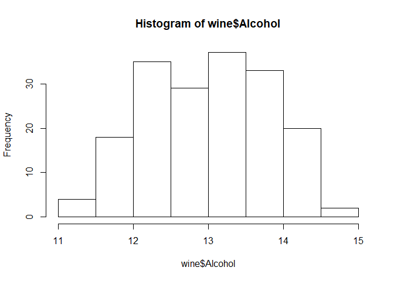
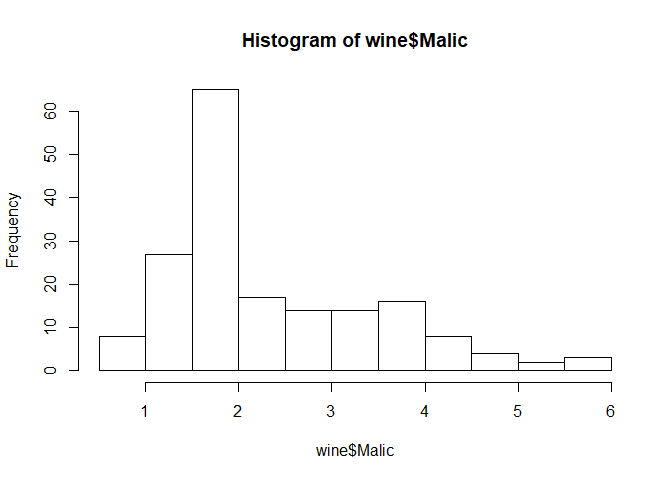

ワイン(のデータ)を味わう
================

-   [準備](#準備)
-   [データ構造を見る](#データ構造を見る)
-   [データの代表値や可視化をしてみる](#データの代表値や可視化をしてみる)

ワインに関するデータを味わってみる。
同時に、rの関数も味わってみてください。

準備
----

``` r
# rattle.dataというパッケージをインストールする。1回目だけ実行すればよい。2回目以降は実行不要。
# install.packages("rattle.data") # 実行するときは、install～の前の#を削除してください。
```

``` r
library(rattle.data) # パッケージをロードする。こちらは毎回実行する。
data("wine") # rattle.dataパッケージに含まれる、wineというデータをロードする。
```

データ構造を見る
----------------

``` r
nrow(wine) # wineは178行で…
```

    ## [1] 178

``` r
ncol(wine) # 14列のデータセットのようだ
```

    ## [1] 14

``` r
head(wine) # データの最初の6行を表示する
```

    ##   Type Alcohol Malic  Ash Alcalinity Magnesium Phenols Flavanoids
    ## 1    1   14.23  1.71 2.43       15.6       127    2.80       3.06
    ## 2    1   13.20  1.78 2.14       11.2       100    2.65       2.76
    ## 3    1   13.16  2.36 2.67       18.6       101    2.80       3.24
    ## 4    1   14.37  1.95 2.50       16.8       113    3.85       3.49
    ## 5    1   13.24  2.59 2.87       21.0       118    2.80       2.69
    ## 6    1   14.20  1.76 2.45       15.2       112    3.27       3.39
    ##   Nonflavanoids Proanthocyanins Color  Hue Dilution Proline
    ## 1          0.28            2.29  5.64 1.04     3.92    1065
    ## 2          0.26            1.28  4.38 1.05     3.40    1050
    ## 3          0.30            2.81  5.68 1.03     3.17    1185
    ## 4          0.24            2.18  7.80 0.86     3.45    1480
    ## 5          0.39            1.82  4.32 1.04     2.93     735
    ## 6          0.34            1.97  6.75 1.05     2.85    1450

``` r
head(wine, n = 10) # データの最初の10行を表示する
```

    ##    Type Alcohol Malic  Ash Alcalinity Magnesium Phenols Flavanoids
    ## 1     1   14.23  1.71 2.43       15.6       127    2.80       3.06
    ## 2     1   13.20  1.78 2.14       11.2       100    2.65       2.76
    ## 3     1   13.16  2.36 2.67       18.6       101    2.80       3.24
    ## 4     1   14.37  1.95 2.50       16.8       113    3.85       3.49
    ## 5     1   13.24  2.59 2.87       21.0       118    2.80       2.69
    ## 6     1   14.20  1.76 2.45       15.2       112    3.27       3.39
    ## 7     1   14.39  1.87 2.45       14.6        96    2.50       2.52
    ## 8     1   14.06  2.15 2.61       17.6       121    2.60       2.51
    ## 9     1   14.83  1.64 2.17       14.0        97    2.80       2.98
    ## 10    1   13.86  1.35 2.27       16.0        98    2.98       3.15
    ##    Nonflavanoids Proanthocyanins Color  Hue Dilution Proline
    ## 1           0.28            2.29  5.64 1.04     3.92    1065
    ## 2           0.26            1.28  4.38 1.05     3.40    1050
    ## 3           0.30            2.81  5.68 1.03     3.17    1185
    ## 4           0.24            2.18  7.80 0.86     3.45    1480
    ## 5           0.39            1.82  4.32 1.04     2.93     735
    ## 6           0.34            1.97  6.75 1.05     2.85    1450
    ## 7           0.30            1.98  5.25 1.02     3.58    1290
    ## 8           0.31            1.25  5.05 1.06     3.58    1295
    ## 9           0.29            1.98  5.20 1.08     2.85    1045
    ## 10          0.22            1.85  7.22 1.01     3.55    1045

``` r
tail(wine) # データの最後の6行を表示する
```

    ##     Type Alcohol Malic  Ash Alcalinity Magnesium Phenols Flavanoids
    ## 173    3   14.16  2.51 2.48       20.0        91    1.68       0.70
    ## 174    3   13.71  5.65 2.45       20.5        95    1.68       0.61
    ## 175    3   13.40  3.91 2.48       23.0       102    1.80       0.75
    ## 176    3   13.27  4.28 2.26       20.0       120    1.59       0.69
    ## 177    3   13.17  2.59 2.37       20.0       120    1.65       0.68
    ## 178    3   14.13  4.10 2.74       24.5        96    2.05       0.76
    ##     Nonflavanoids Proanthocyanins Color  Hue Dilution Proline
    ## 173          0.44            1.24   9.7 0.62     1.71     660
    ## 174          0.52            1.06   7.7 0.64     1.74     740
    ## 175          0.43            1.41   7.3 0.70     1.56     750
    ## 176          0.43            1.35  10.2 0.59     1.56     835
    ## 177          0.53            1.46   9.3 0.60     1.62     840
    ## 178          0.56            1.35   9.2 0.61     1.60     560

``` r
tail(wine, n = 8) # データの最後の8行を表示する
```

    ##     Type Alcohol Malic  Ash Alcalinity Magnesium Phenols Flavanoids
    ## 171    3   12.20  3.03 2.32       19.0        96    1.25       0.49
    ## 172    3   12.77  2.39 2.28       19.5        86    1.39       0.51
    ## 173    3   14.16  2.51 2.48       20.0        91    1.68       0.70
    ## 174    3   13.71  5.65 2.45       20.5        95    1.68       0.61
    ## 175    3   13.40  3.91 2.48       23.0       102    1.80       0.75
    ## 176    3   13.27  4.28 2.26       20.0       120    1.59       0.69
    ## 177    3   13.17  2.59 2.37       20.0       120    1.65       0.68
    ## 178    3   14.13  4.10 2.74       24.5        96    2.05       0.76
    ##     Nonflavanoids Proanthocyanins     Color  Hue Dilution Proline
    ## 171          0.40            0.73  5.500000 0.66     1.83     510
    ## 172          0.48            0.64  9.899999 0.57     1.63     470
    ## 173          0.44            1.24  9.700000 0.62     1.71     660
    ## 174          0.52            1.06  7.700000 0.64     1.74     740
    ## 175          0.43            1.41  7.300000 0.70     1.56     750
    ## 176          0.43            1.35 10.200000 0.59     1.56     835
    ## 177          0.53            1.46  9.300000 0.60     1.62     840
    ## 178          0.56            1.35  9.200000 0.61     1.60     560

``` r
names(wine) # 列の名前を表示する
```

    ##  [1] "Type"            "Alcohol"         "Malic"          
    ##  [4] "Ash"             "Alcalinity"      "Magnesium"      
    ##  [7] "Phenols"         "Flavanoids"      "Nonflavanoids"  
    ## [10] "Proanthocyanins" "Color"           "Hue"            
    ## [13] "Dilution"        "Proline"

``` r
length(names(wine)) # 列の名前は14個ある。列の数と一致している(当たり前)。
```

    ## [1] 14

列の名前の意味は、以下のサイトの中段あたりを参照のこと。
<https://qiita.com/Dixhom/items/7c33a1dc85144e1da822>

``` r
wine$Alcohol # wineデータセットのAlcohol(アルコール)列のみを取り出す
```

    ##   [1] 14.23 13.20 13.16 14.37 13.24 14.20 14.39 14.06 14.83 13.86 14.10
    ##  [12] 14.12 13.75 14.75 14.38 13.63 14.30 13.83 14.19 13.64 14.06 12.93
    ##  [23] 13.71 12.85 13.50 13.05 13.39 13.30 13.87 14.02 13.73 13.58 13.68
    ##  [34] 13.76 13.51 13.48 13.28 13.05 13.07 14.22 13.56 13.41 13.88 13.24
    ##  [45] 13.05 14.21 14.38 13.90 14.10 13.94 13.05 13.83 13.82 13.77 13.74
    ##  [56] 13.56 14.22 13.29 13.72 12.37 12.33 12.64 13.67 12.37 12.17 12.37
    ##  [67] 13.11 12.37 13.34 12.21 12.29 13.86 13.49 12.99 11.96 11.66 13.03
    ##  [78] 11.84 12.33 12.70 12.00 12.72 12.08 13.05 11.84 12.67 12.16 11.65
    ##  [89] 11.64 12.08 12.08 12.00 12.69 12.29 11.62 12.47 11.81 12.29 12.37
    ## [100] 12.29 12.08 12.60 12.34 11.82 12.51 12.42 12.25 12.72 12.22 11.61
    ## [111] 11.46 12.52 11.76 11.41 12.08 11.03 11.82 12.42 12.77 12.00 11.45
    ## [122] 11.56 12.42 13.05 11.87 12.07 12.43 11.79 12.37 12.04 12.86 12.88
    ## [133] 12.81 12.70 12.51 12.60 12.25 12.53 13.49 12.84 12.93 13.36 13.52
    ## [144] 13.62 12.25 13.16 13.88 12.87 13.32 13.08 13.50 12.79 13.11 13.23
    ## [155] 12.58 13.17 13.84 12.45 14.34 13.48 12.36 13.69 12.85 12.96 13.78
    ## [166] 13.73 13.45 12.82 13.58 13.40 12.20 12.77 14.16 13.71 13.40 13.27
    ## [177] 13.17 14.13

``` r
head(wine$Alcohol, n = 10) # ちょっと多すぎるので、最初の10個のみを取り出してみる
```

    ##  [1] 14.23 13.20 13.16 14.37 13.24 14.20 14.39 14.06 14.83 13.86

``` r
head(wine$Color) # Color(色彩強度)列の、最初の6個のデータを取り出す
```

    ## [1] 5.64 4.38 5.68 7.80 4.32 6.75

データの代表値や可視化をしてみる
--------------------------------

wineデータセットのうち、Alcohol(アルコール)列のみを使う。

``` r
hist(wine$Alcohol) # ヒストグラム
```

 割と、左右対称なグラフですね。

``` r
mean(wine$Alcohol) # 平均値
```

    ## [1] 13.00062

``` r
median(wine$Alcohol) # 中央値
```

    ## [1] 13.05

``` r
max(wine$Alcohol) # 最大値
```

    ## [1] 14.83

``` r
min(wine$Alcohol) # 最低値
```

    ## [1] 11.03

``` r
summary(wine$Alcohol) # 上記の代表値をまとめて表示する
```

    ##    Min. 1st Qu.  Median    Mean 3rd Qu.    Max. 
    ##   11.03   12.36   13.05   13.00   13.68   14.83

左右対称の分布だったので、中央値 median と平均値 mean はほぼ同じような値ですね。
"1st Qu."はデータを小さい順に並べて、下から25%目のデータの値、
"3rd Qu."は、下から75%目(上から25%目)の値。
ちなみに、中央値 median は50%目の値ですね。
ワインのアルコール度なので、当然13度くらいの値になりますよね。

``` r
sd(wine$Alcohol) # 標準偏差
```

    ## [1] 0.8118265

次は、ワインに含まれるリンゴ酸(Malic acid)のデータを見てみる。

``` r
hist(wine$Malic)
```



おー、ゆがんだ分布だ。

``` r
summary(wine$Malic)
```

    ##    Min. 1st Qu.  Median    Mean 3rd Qu.    Max. 
    ##   0.740   1.603   1.865   2.336   3.083   5.800

ゆがんだ分布なので、中央値よりも平均値が大きくなる。
他のデータでも分布や、代表値を見てみてください。
