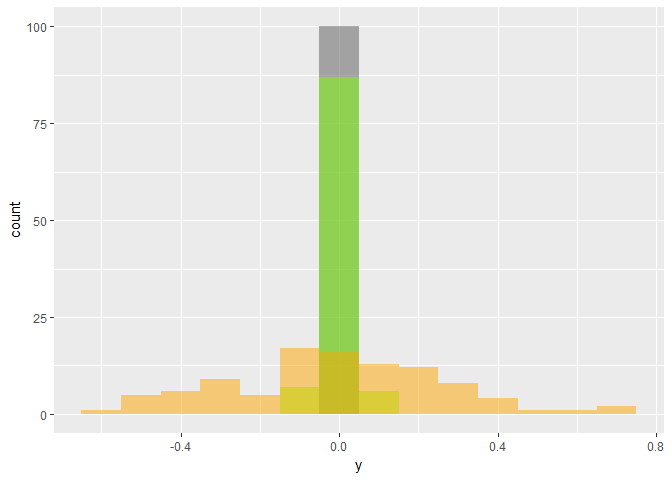
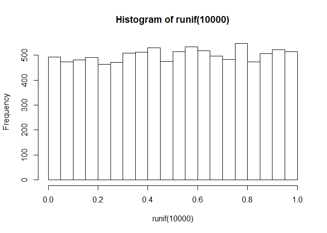
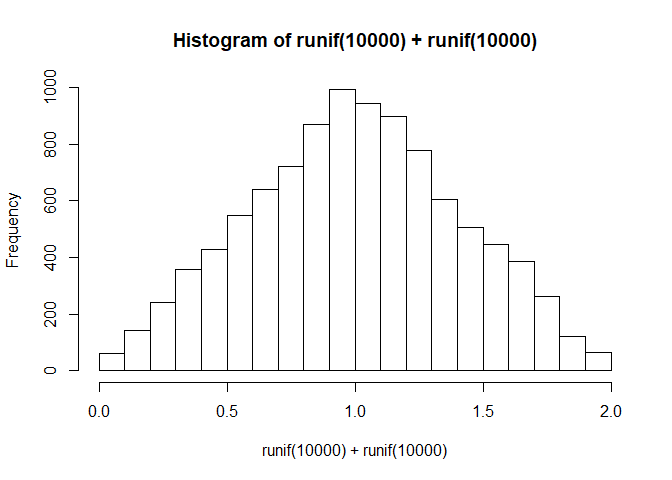
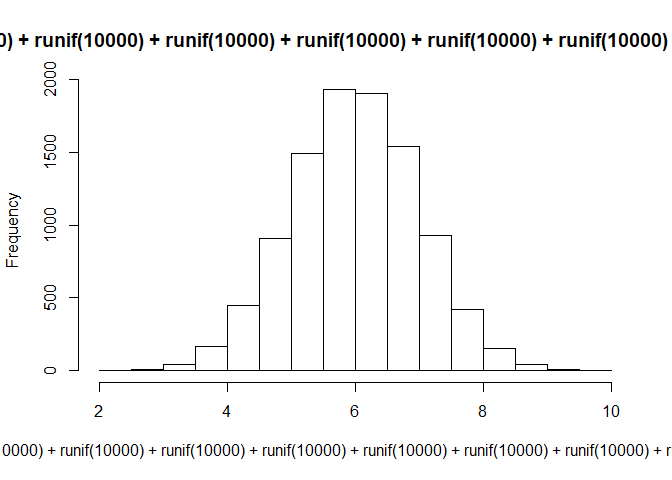
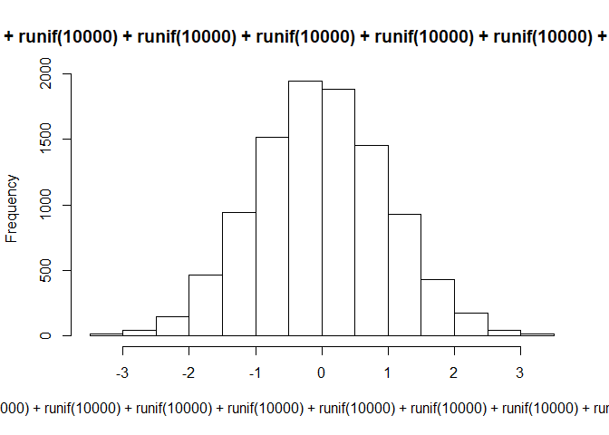
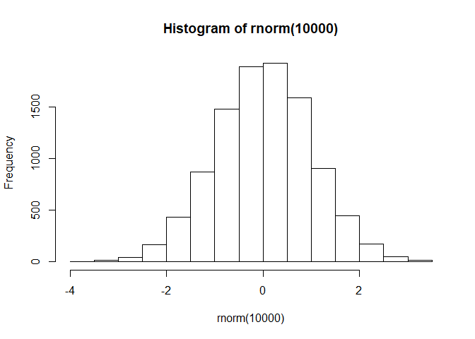
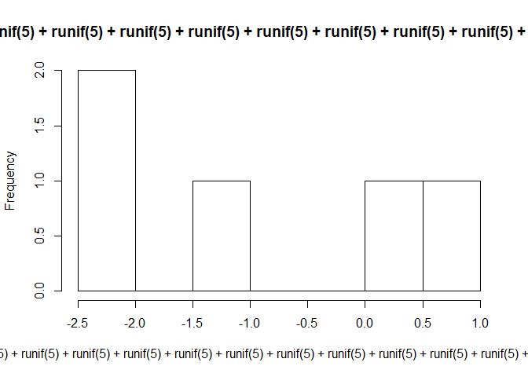

Chapter2 統計の基礎
================

-   [2.1 尺度水準](#尺度水準)
-   [2.2 代表値](#代表値)
-   [2.3 確率変数、乱数、母集団、標本](#確率変数乱数母集団標本)
-   [2.4 分散と標準偏差](#分散と標準偏差)
-   [2.5 中心極限定理と正規分布](#中心極限定理と正規分布)
-   [2.6 コーシー分布](#コーシー分布)
-   [2.7 正規分布から導かれる分布](#正規分布から導かれる分布)

2.1 尺度水準
------------

-   人種、車のメーカー、社員の所属部署
-   順位、成績(優/良/可/不可)、顧客満足度
-   温度、日付
-   長さ、重さ、割合に意味があるもの

2.2 代表値
----------

平均を求める関数はmean()。

``` r
X = c(0, 7, 8, 9, 100)
mean(X)
```

    ## [1] 24.8

mean関数には、na.rmというオプションがある。

``` r
Y = c(0, 7, 8, NA, 0/0)
Y
```

    ## [1]   0   7   8  NA NaN

``` r
mean(Y)
```

    ## [1] NA

``` r
mean(Y, na.rm = TRUE)
```

    ## [1] 5

mean関数には、trimというオプションもある。

``` r
mean(X, trim = 0.2)
```

    ## [1] 8

``` r
mean(Y, trim = 0.2)
```

    ## [1] NA

``` r
mean(Y, trim = 0.2, na.rm = TRUE)
```

    ## [1] 5

中央値はmedian()という関数で求める。

``` r
median(X)
```

    ## [1] 8

``` r
median(Y)
```

    ## [1] NA

``` r
median(Y, na.rm = TRUE)
```

    ## [1] 7

平均値と中央値、どちらを使ったらいいかは、ヒストグラムの形によってことなる。

``` r
hist(rnorm(10000)) # 標準正規分布のヒストグラム
```


``` r
hist(rchisq(10000, 10)) # 自由度10のカイ二乗分布の(以下略)
```


``` r
hist(rcauchy(10000)) # コーシー分布の(以下略)
```


2.3 確率変数、乱数、母集団、標本
--------------------------------

確率変数と乱数は同じ意味合い。ただし、教科書では、以下の二つのルールに従っている。

1.  確率変数が何らかの「同じ種類のヒストグラム(確率分布が同じ, identically distibuted)」にしたがい
2.  乱数を選ぶときは、「選ぶ」という行為が互いに影響を与えない(独立, independent)

母集団と標本の関係を会社で例えると、

-   母集団：社員全員
-   大きさnの(一つの)標本：社員をランダムにn人選んだときの集団 ※ nのことを(サンプルor標本)サイズという。標本数またはサンプル数とは言わない。

母平均と標本平均を、上記の母集団と標本の身長を例に考えてみる。

-   身長の母平均：社員全員の身長の平均。何回計算しても同じ値。
-   身長の標本平均：社員をランダムにn人選んだときの集団の身長の平均。選ぶたびに値が変わる。

標本平均は必ずしも母平均とは等しくならないが、①(サンプル)サイズを増やしたり、②標本数を増やすと、母平均に近づく。

例えば、標準正規分布から5個乱数を選んだ時(サンプルサイズ5で標本数1)の平均は、何回繰り返しても、0にならない。

``` r
mean(rnorm(5)) 
```

    ## [1] -0.5872707

①標準正規分布から1万個の乱数を選んだ時(サンプルサイズ1万個で標本数1)の平均はより0に近い。

``` r
mean(rnorm(10000))
```

    ## [1] -0.004671343

②「標準正規分布から5個乱数を選んだ時の平均」を1万個計算(サンプルサイズ5で標本数1万)して、その平均をとったときの値は、より0に近い。

``` r
mean(replicate(10000, mean(rnorm(5))))
```

    ## [1] 0.001932799

平均には以下の性質がある(線形性、というが、覚えなくてよい)。

``` r
X = c(1,2,3,4,5)
Y = c(5,3,1,8,9)
```

``` r
2 * X
```

    ## [1]  2  4  6  8 10

``` r
3 * Y
```

    ## [1] 15  9  3 24 27

``` r
mean(2 * X + 3 * Y) # この計算と…
```

    ## [1] 21.6

``` r
2 * mean(X) + 3 * mean(Y) # この計算が、同じ値になる性質を、線形性という
```

    ## [1] 21.6

2.4 分散と標準偏差
------------------

分散あるいは母分散、またはその平方根である標準偏差は、確率分布(ヒストグラム)のばらつきの度合いを表す。 正規分布で見てみよう。

``` r
hist(rnorm(10000)) # 標準正規分布のヒストグラム。つまり、標準偏差は1、分散も1
```


``` r
hist(rnorm(10000, sd = 2)) # 平均0、標準偏差は2(分散なら4)の正規分布
```


``` r
hist(rnorm(10000, sd = 10)) # 平均0、標準偏差は10(分散なら100)の正規分布
```


上記の三つの分布を重ねて描いてみる。グレーが標準偏差1, グリーンが標準偏差2、オレンジが標準偏差10。分散(=標準偏差の2乗)は、まさに分布の広がり具合を表している。


あるサイズnの標本の分散を計算したいが、分散の計算式には、母平均を使うことになっている。
しかし、母平均は分からないことも多い(例えば、母集団を東京都民とすると、その身長の母平均を求めるのは困難を極める)。
なので、標本分散の計算に、母平均ではなく、標本平均を使う。
また、このときサンプルサイズnで割らず、n-1で割る。
すると、この計算で求めた標本分散の平均は母分散と一致する。
n-1で割らず、nで割ると、母分散と一致しない。
「n-1で割る分散」の意味を確かめるために、数値実験をしてみよう。

``` r
x = 1:5 # 母集団
x
```

    ## [1] 1 2 3 4 5

``` r
var(x) # 母分散
```

    ## [1] 2.5

``` r
var(c(2,3,4,5)) # 標本分散1
```

    ## [1] 1.666667

``` r
var(c(1,3,4,5)) # 標本分散2
```

    ## [1] 2.916667

``` r
var(c(1,2,4,5)) # 標本分散3
```

    ## [1] 3.333333

``` r
var(c(1,2,3,5)) # 標本分散4
```

    ## [1] 2.916667

``` r
var(c(1,2,3,4)) # 標本分散5
```

    ## [1] 1.666667

``` r
#　標本分散の平均 = 母分散
mean(c(var(c(2,3,4,5)), var(c(1,3,4,5)), var(c(1,2,4,5)), var(c(1,2,3,5)), var(c(1,2,3,4))))
```

    ## [1] 2.5

「nで割る分散」で数値実験をしてみる。

まずは、「nで割る分散」を計算する関数を作る。

``` r
varp <- function(x){var(x) * (length(x) - 1) / length(x)} 
```

``` r
varp(x) # 母分散
```

    ## [1] 2

``` r
varp(c(2,3,4,5)) # 標本分散1
```

    ## [1] 1.25

``` r
varp(c(1,3,4,5)) # 標本分散2
```

    ## [1] 2.1875

``` r
varp(c(1,2,4,5)) # 標本分散3
```

    ## [1] 2.5

``` r
varp(c(1,2,3,5)) # 標本分散4
```

    ## [1] 2.1875

``` r
varp(c(1,2,3,4)) # 標本分散5
```

    ## [1] 1.25

``` r
#　標本分散の平均 ≠ 母分散
mean(c(varp(c(2,3,4,5)), varp(c(1,3,4,5)), varp(c(1,2,4,5)), varp(c(1,2,3,5)), varp(c(1,2,3,4))))
```

    ## [1] 1.875

「n-1で割る分散」(の平均値)は、母分散からのズレ(バイアス、bias)がない。
なので、このズレのなさ(＝偏りのなさ)から、不偏分散、または母分散の不偏推定量という。

sd関数は、標本の標準偏差を求める。計算式は、不偏分散の平方根である。

``` r
x = 1:10
var(x)
```

    ## [1] 9.166667

``` r
sqrt(var(x)) # 不偏分散の平方根
```

    ## [1] 3.02765

``` r
sd(x) # 標本の標準偏差
```

    ## [1] 3.02765

さて、ある確率分布の標本平均を考える。標本平均なので、標本をとるたびにその値は変わるが、①サンプルサイズを大きくするか、②標本数を大きくすれば、標本平均は確率分布の母平均に近づくことを2.3で述べた。

いま、サンプルサイズ(教科書では、測定回数)をnにして、標本数を一定(例えば、20)にしたとき、20個の標本平均が手に入ることになる。さらにこの「20個の標本平均」の「平均」と「標準偏差(標準誤差、と言う)」も計算できる。実際に数値で見てみよう。

``` r
mean(rnorm(5)) # 標準正規分布からサンプルサイズ5の標本平均を求める
```

    ## [1] -0.3544661

``` r
replicate(20, mean(rnorm(5))) # 標準正規分布からサンプルサイズ5の標本平均を、20回求める
```

    ##  [1] -0.20611131 -0.10881786  0.03807844  0.21474924  1.28019538
    ##  [6] -0.02917545  0.73596022  0.45498618 -0.52475696  0.24820750
    ## [11] -0.12110935  0.32525865 -0.01360135 -0.31258211  0.69247362
    ## [16] -0.70403971  0.21881630 -0.19246774  0.07677669 -0.81385865

``` r
mean(replicate(20, mean(rnorm(5)))) # 20個の標本平均の平均を求める
```

    ## [1] -0.07988108

``` r
sd(replicate(20, mean(rnorm(5)))) # 20個の標本平均の標準偏差(＝標準誤差)を求める
```

    ## [1] 0.4431322

さて教科書2.3の①で、サンプルサイズ(測定回数)nを増やすと「標本平均の平均」は母平均に近づくことは述べたが、「標本平均の標準偏差」(＝標準誤差)は、1/√nに比例するらしい。つまり、サンプルサイズ(測定回数)が100倍になるなら1/10になるし、10000倍になるなら1/100になるということだ。実験してみよう。

``` r
sd(replicate(20, mean(rnorm(10)))) # サンプルサイズ10で標本数20、標本平均20個の標準偏差
```

    ## [1] 0.2905506

``` r
sd(replicate(20, mean(rnorm(1000)))) # サンプルサイズ1000(10の100倍)で標本数20、標本平均20個の標準偏差
```

    ## [1] 0.03028037

``` r
sd(replicate(20, mean(rnorm(100000)))) # サンプルサイズ100000(10の10000倍)で標本数20、標本平均20個の標準偏差
```

    ## [1] 0.003744606

nが増えるたびに、「標本平均の標準偏差」(＝標準誤差)が反比例していく。ぴったり1/10や1/100ではないが、大体数字のオーダーはあっていることが確認できる。
さらにヒストグラムを描いて、確かめてみよう。ついでに、今度は標本数を20ではなく、100にしてみる。

``` r
hist(replicate(100, mean(rnorm(10)))) # サンプルサイズ10で標本数100、標本平均100個分のヒストグラム
```


``` r
hist(replicate(100, mean(rnorm(1000))))  # サンプルサイズ1000で標本数100、標本平均100個分のヒストグラム
```


``` r
hist(replicate(100, mean(rnorm(100000))))  # サンプルサイズ100000で標本数100、標本平均100個分のヒストグラム
```


標準偏差とはデータのばらつき具合だったが、ヒストグラムの横軸に注目してみると、ばらつき具合がどんどん小さくなっていく。
上記の三つのヒストグラムを重ねて描いてみると、以下の通り。グレーのヒストグラムは、オレンジに比べて分散があまりに小さいので、0(平均)上にしか分布していない。どのヒストグラムが、サンプルサイズ10、1000、100000か、考えてみてください。



さらに、最大値、最小値や、四分位数を見てみよう。今度は標本数を20ではなく、50にしてみる。

``` r
summary(replicate(50, mean(rnorm(10))))
```

    ##      Min.   1st Qu.    Median      Mean   3rd Qu.      Max. 
    ## -0.812818 -0.202390  0.009416  0.018928  0.203542  0.778388

``` r
summary(replicate(50, mean(rnorm(1000))))
```

    ##      Min.   1st Qu.    Median      Mean   3rd Qu.      Max. 
    ## -0.079292 -0.020805 -0.006961 -0.005119  0.016276  0.068593

``` r
summary(replicate(50, mean(rnorm(100000))))
```

    ##       Min.    1st Qu.     Median       Mean    3rd Qu.       Max. 
    ## -5.947e-03 -1.569e-03 -3.028e-04 -3.567e-05  1.106e-03  6.264e-03

サンプルサイズを100倍すると、最小値や最大値が、大体1/10くらいになっていることがわかる。

以上より、母平均が分からなくても、ランダムに十分なサンプルサイズがとれれば(nが十分に大きければ)、標本平均は母平均に近づき、かつ、母平均からのブレ幅(標本平均の標準誤差)も小さくなるので、全数調査をしなくても母平均に十分近しい値がわかる、ということである。
これは、標本平均の標準誤差の性質(1/√n倍になる)による。
多くの人は感覚でわかることかもしれないが、ここでは数値実験で確かめてみた。

2.5 中心極限定理と正規分布
--------------------------

一様分布、という確率変数がある。rでは、runif関数で、一様分布(**unif**orm distribution)に従う乱数(一様乱数)をつくることができる。ヒストグラムで一様乱数の形を見てみよう。

``` r
hist(runif(10000)) # 10000個の一様乱数のヒストグラム
```



``` r
hist(runif(10000), freq = FALSE) # ヒストグラムにオプションをつけてみました。なにが変わったかわかりますか？
```


一様乱数の平均値と分散を計算してみよう。

``` r
mean(runif(10000))
```

    ## [1] 0.5016973

``` r
var(runif(10000))
```

    ## [1] 0.08239588

runif関数のデフォルト値は、最大値1、最小値0となるので、平均は0.5となる。分散の計算は、積分とかが出てきて難しいので省略する。

さて、10000個の一様乱数を2セット持ってきて、10000の各成分ごとに足して、足した結果、10000個になった乱数をヒストグラムにしてみよう。 これまでの言い方を踏襲するなら、「一様乱数のサンプルサイズ10000の2標本を成分ごとに足して、ヒストグラムにする」となる。

``` r
hist(runif(10000) + runif(10000))
```



三角形になった。グラフから読み取ると、平均値は1に近いようだ。平均値0.5の一様乱数を二つ足したのだから、平均値は2倍されて1になるだろう、と言われると、納得できる。ちなみに分散を計算してみると0.1689556となり、やっぱり2倍くらいになっている。

では、3標本にするとどうなるか。

``` r
hist(runif(10000) + runif(10000) + runif(10000))
```


3標本だと、釣り鐘型になってきた。正規分布に近いのではないだろうか。平均値は想像通り1.5だし、分散も0.2481937、やはり3倍くらいになっている。

でも、runifを3回足すのも疲れてきた。3倍してはいけないのだろうか？

``` r
hist(runif(10000) * 3)
```


これだとうまくいかない。なぜだろうか？「グラフの横軸」をヒントに、rでどのような計算がされるか、考えてみよう(各自宿題)。

さて、突然だが、さっき計算した「一様乱数の分散」の逆数を、計算してみよう。

``` r
1 / var(runif(10000))
```

    ## [1] 12.0884

12くらいの値になった。つまり、一様乱数の分散は、だいたい1/12くらいの値になるということだ。
では、分散を1にするために、一様乱数を12個足したヒストグラムを見てみよう。

``` r
hist(runif(10000) + runif(10000) + runif(10000) + runif(10000) + runif(10000) + runif(10000) + runif(10000) + runif(10000) + runif(10000) + runif(10000) + runif(10000) + runif(10000))
```



これで分散は1になったが、今度は平均値が6くらいになってしまったので、6を引いてみよう。6を引いても、分散の値は変わらないことに注意する。

``` r
hist(runif(10000) + runif(10000) + runif(10000) + runif(10000) + runif(10000) + runif(10000) + runif(10000) + runif(10000) + runif(10000) + runif(10000) + runif(10000) + runif(10000) - 6)
```



さて、これで、平均値0、分散1のヒストグラムができた。さて、どこかで見たような…

``` r
hist(rnorm(10000))
```



そう、これは標準正規分布(つまり平均0、分散1の正規分布)と同じようにみえる。
これが、中心極限定理である。十分にnが大きい確率分布をいくつか足していくと、だいたいどんな確率分布を足したとしても、正規分布に近づいていくのだ。
rのおかげで、数式を使わずに、中心極限定理を体感できた。

さて、教科書を見ると、「nが十分に大きくなると」という条件がある。ここまではn = 10000として計算してきたが、n = 5のように小さくすると、中心極限定理は成り立たないのだろうか？実験してみよう。さっきと同じようにrunifを12回足すが、各々サンプルサイズは5にしてみる。

``` r
hist(runif(5) + runif(5) + runif(5) + runif(5) + runif(5) + runif(5) + runif(5) + runif(5) + runif(5) + runif(5) + runif(5) + runif(5) - 6)
```



やはり、正規分布には見えない。では、n = 50ではどうなるか。

``` r
hist(runif(50) + runif(50) + runif(50) + runif(50) + runif(50) + runif(50) + runif(50) + runif(50) + runif(50) + runif(50) + runif(50) + runif(50) - 6)
```


やっぱり正規分布には見えない。
nが沢山あるときのありがたさを感じたい。

さて、ここからは、確率分布の面積と確率の関係について、述べておく。
「標準正規分布(平均が0、標準偏差が1となる正規分布)」のグラフは、正規分布の確率密度関数であるdnorm関数を利用すると、以下の通りに描ける。正規分布のグラフは左右対称であることに注意する。正規分布は-∞から+∞までグラフが伸びていくが、ここでは横軸を±4で区切っている。

``` r
curve(dnorm(x), xlim = c(-4, 4)); title("dnorm(x)")
```


教科書27ページ中ごろあたりに、分布関数pnorm(q)が数式と一緒に紹介されている。この数式∫<sub>−∞</sub><sup>*q*</sup>*d**n**o**r**m*(*x*)*d**x*には、積分記号（∫<sub>−∞</sub><sup>*q*</sup>）があり、なんらかの面積を求めているようだ。この積分記号の中にあるqが-2, -1, 0, or 3となるとき、この分布関数が求めている面積を図示してみると、以下の通りになる。


ちなみに、上記のグラフで、端(-∞)から端(+∞)までの面積を求めると(積分記号で書くと∫<sub>−∞</sub><sup>+∞</sup>)、その数値は1になる。

さて、分布関数pnorm(q)に、-2, -1, 0, 3を代入したときの値を見てみよう。

``` r
pnorm(-2)
```

    ## [1] 0.02275013

``` r
pnorm(-1)
```

    ## [1] 0.1586553

``` r
pnorm(0)
```

    ## [1] 0.5

``` r
pnorm(3)
```

    ## [1] 0.9986501

``` r
# もっと簡単に4つの値を求めるなら
q <- c(-2, -1, 0, 3)
pnorm(q)
```

    ## [1] 0.02275013 0.15865525 0.50000000 0.99865010

このとき、それぞれの値は、上で書いたグラフの緑の面積の大きさを示している。

例えば、pnorm(0)の値は、「標準正規分布の面積(= 1)」のちょうど半分、0.5になっていることが分かり、これは「q = 0のグラフの緑部分の面積」の見た目とも一致する。そして、この値が「標準正規分布で0より小さい値となる(-∞から0となる)確率」なのである。


同様に、pnorm(-2)の値である0.0227501は「標準正規分布で-2より小さくなる確率」と言える。


それでは、「-1から1になる確率」を求めたいときは、どうすればいいだろうか。
「-1から1になる確率」をグラフ上に面積で図示すると、以下の通りである。


この面積を求めたいときは、まず「-∞から1までの面積」から、「-∞から-1までの面積」を引いてあげればよい。


この面積の数値は、pnorm関数で簡単に計算できる。 「-∞から1までの面積」はpnorm(1)であり、 「-∞から-1までの面積」はpnorm(-1)なので、 「-1から1までの面積」はpnorm(1) - pnorm(-1)で、計算してみると0.6826895となる。

さて、同様の面積(確率)を求めるときに、標準正規分布のグラフの端から端までの面積が1であることを利用すると、「全体の面積(= 1)」から、「-∞から-1までの面積」と「1から∞までの面積」を引いても同じ値になるはずである。


さらに、グラフが左右対称であることを利用すると、「-∞から-1までの面積」と「1から∞までの面積」は等しいことが分かる。
よって、1から、「-∞から-1までの面積」を二つ分引けば、求めたい面積(確率)になり、これは1 - 2 × pnorm(-1)で求めると0.6826895、上で計算した値とぴったり一致する。

さて、これまでの議論では標準正規分布を使ってきた。「標準」の意味は平均(μ、ミュー)が0、標準偏差(σ、シグマ)が1、であった。 よって、標準正規分布で「-1から1までの面積(1 - 2 × pnorm(-1))」というのは、平均値から±1標準偏差(記号で書けばμ ± 1σ)の間に収まる確率を求めたことと同じである。同様に、μ ± 2σとなる確率は1 - 2 × pnorm(-2)で0.9544997、μ ± 3σとなる確率は1 - 2 × pnorm(-3)で0.9973002となり、これを図示すると以下の通りである。μ ± 3σは、ほぼ面積1に近い値になることが分かるだろう。


次に、標準正規分布ではなく、「日本人の34歳男性の身長の正規分布」を考えてみよう。便宜的に、日本人の34歳男性の身長は、平均が172cm、標準偏差が5.5cmの正規分布に従うものとすると、確率密度関数はdnorm(x, mean = 172, sd = 5.5)となる。グラフを描くと、以下の通りである。

``` r
curve(dnorm(x, mean = 172, sd = 5.5), xlim = c(150, 195)); title("dnorm(x, mean = 172, sd = 5.5)")
```


ある34歳日本人男性を選んだ時、その人の身長が160cm以上170cm未満である確率は、pnorm(170, mean = 172, sd = 5.5) - pnorm(160, mean = 172, sd = 5.5)を計算して、0.3435033となる。グラフに図示すると以下の通りである。


同様に、身長が174cm以上175cm未満である確率は、pnorm(175, mean = 172, sd = 5.5) - pnorm(174, mean = 172, sd = 5.5)を計算して、0.0653443となる。グラフに図示すると以下の通りである。


さて、標準正規分布のヒストグラム(度数分布表)を描く関数は以下の通りである。一応、関数の解説をすると、

-   rnorm関数で、標準正規分布に従う乱数を10,000個つくる
-   つくった乱数をhist関数でヒストグラムにする

``` r
hist(rnorm(10000))
```


平均172、標準偏差5.5の正規分布のヒストグラム(度数分布表)を描く関数は以下の通り。

``` r
hist(rnorm(10000, mean = 172, sd = 5.5))
```


なにが違うかわかりましたか?

-   標準正規分布：rnorm(10000)
-   平均172、標準偏差5.5の正規分布：rnorm(10000, mean = 172, sd = 5.5)

後者は、「平均mean(発音はミーン)」、「標準偏差sd(英語でstandard deviation、発音はスタンダードデヴィエイション)を」を、それぞれ172と5.5と明示的に指定している。前者は明示的に指定していない。

実は、関数にオプションがあるときに、そのオプションを明示的に指定しないと、Rはデフォルト値を使って関数を実行する。rnorm関数のmeanのデフォルト値は0、sdのデフォルト値は1、つまりデフォルト値が標準正規分布(平均0、標準偏差1)になるように設定されている。

各関数のデフォルト値を確認したいときは、コンソールで「?関数」とタイプしてみてください。

2.6 コーシー分布
----------------

(省略)

2.7 正規分布から導かれる分布
----------------------------

(省略)
